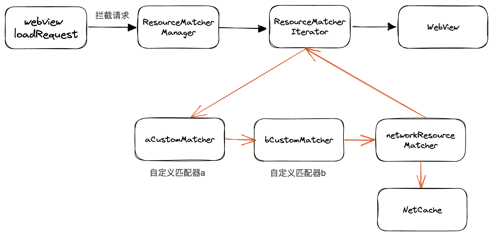
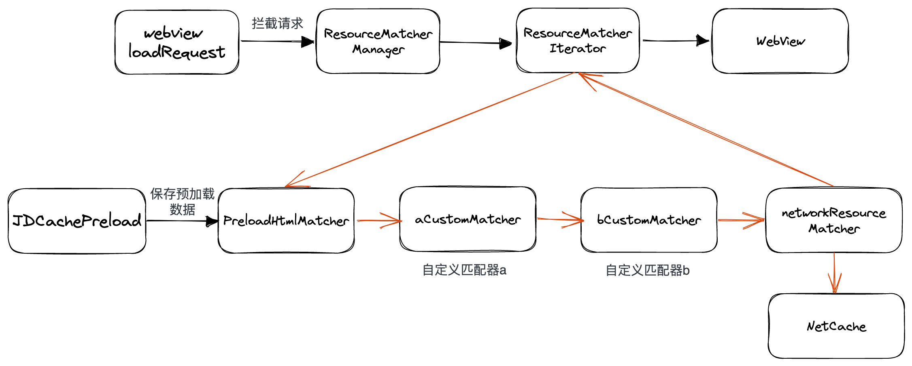
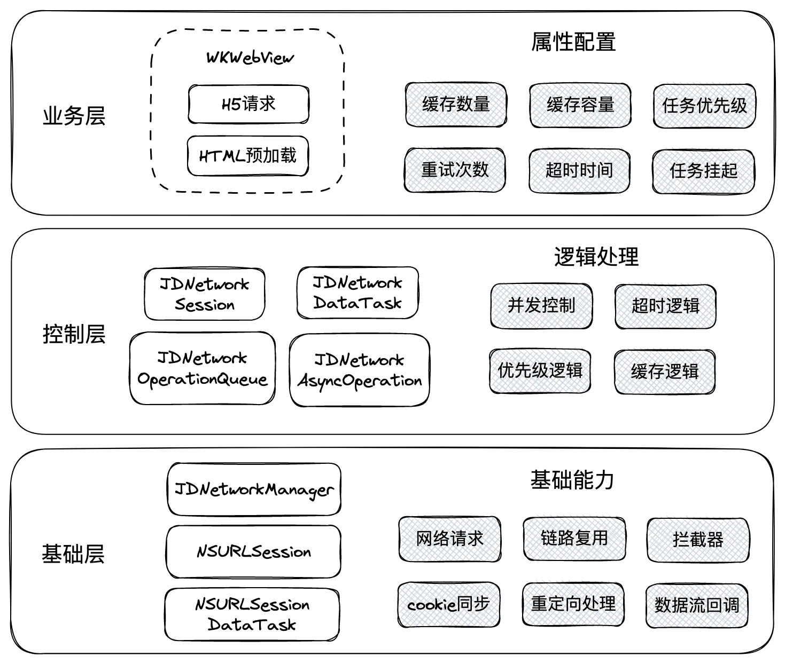

# JDCache
JDCache iOS端是基于[WKURLSchemeHandler](https://developer.apple.com/documentation/webkit/wkurlschemehandler)协议设计，通过拦截http/https的请求，来匹配本地离线资源，加快H5页面加载速度。有如下特点：
+ 代码无侵入
+ H5业务接入无改造成本
+ 灵活、可自定义的匹配策略

JDCache还提供了HTML预加载能力，并且内置了HTML匹配器和网络请求匹配器，使用者只需实现自己的离线匹配逻辑。


## 依赖

JDCache 支持 [CocoaPods](https://cocoapods.org) 安装使用，仅需要在您的Podfile添加:

```ruby
pod 'JDHybrid/JDCache'
```

可参考下面教程创建测试离线包

[离线包生成](../../../nodejs/README.md)

## 基本使用

#### 一、初始化JDCache
APP启动时初始化JDCache，设置netCache网络缓存代理、是否开启日志。
* netCache 用于缓存网络资源，遵守[http标准缓存协议](https://developer.mozilla.org/zh-CN/docs/Web/HTTP/Caching)。实例需满足JDURLCacheDelegate协议，推荐使用YYCache。

```objc
[JDCache shareInstance].netCache = self.xhCache;
[JDCache shareInstance].LogEnabled = YES;
```

#### 二、开启Hybrid

仅需一行代码即可开启Hybrid：

```objc
configuration.loader.enable = YES;
```

* 注意：此代码必须在使用configuration创建WKWebView实例之前设置才生效


#### 三、创建匹配器

1. 创建单个匹配器必须实现JDResourceMatcherImplProtocol协议
   
```objc
@protocol JDResourceMatcherImplProtocol <NSObject>
// 说明：此api根据传入的NSURLRequest实例，需返回是否拦截处理。
- (BOOL)canHandleWithRequest:(NSURLRequest *)request;

// 说明：此api根据传入的NSURLRequest实例，回调response、data、fail或success等数据。
// * 若API`canHandleWithRequest:`返回YES，此API需要正常回调数据；
// * 若API`canHandleWithRequest:`返回NO，则此API不会被调用。
- (void)startWithRequest:(NSURLRequest *)request
        responseCallback:(JDNetResponseCallback)responseCallback
            dataCallback:(JDNetDataCallback)dataCallback
            failCallback:(JDNetFailCallback)failCallback
        successCallback:(JDNetSuccessCallback)successCallback
        redirectCallback:(JDNetRedirectCallback)redirectCallback;
@end
```

2. 设置匹配器数组，例如：

```objc
configuration.loader.matchers = @[mapResourceMatcher,aaaResourceMatcher,bbbResourceMatcher];
```

* 将所有的匹配器，以数组的形式赋值给JDCacheLoader实例的matchers字段，JDCache在拦截到请求时，会按顺序依次传递给数组中的匹配器去处理。

## 更多使用

#### HTML预加载

通过以下步骤来执行预加载：

1. 创建JDCachePreload实例

```objc
JDCachePreload *preload = [JDCachePreload new];
preload.request = [NSURLRequest requestWithURL:[NSURL URLWithString:@"https://www.jd.com"]];
preload.enable = YES;
[preload startPreload];
```

2. 将JDCachePreload实例赋值给loader的preload字段
   
```objc
configuration.loader.preload = preload;
```

设置完成后，在JDCache拦截到此HTML的请求后会优先使用预加载数据。

#### 降级

通过以下方法来降级：

```objc
configuration.loader.degrade = YES;
```
设置完成后，在本次的WebView加载中，将会全部走网络请求，不使用匹配器资源。

## 原理介绍
#### 一. 配置开启
通过`configuration.loader.enable = YES;`开启hybrid能力时，自动注册`schemeHander`、注册js桥、注入必要的js。

#### 二. 拦截匹配
使用`WKURLSchemeHandler`协议拦截每个请求，转发到`configuration.loader.matchers`中依次匹配，若匹配器命中，返回给WebView，此次匹配流程终止。
若都未命中，使用内置的网络匹配器（JDNetworkResourceMatcher），发起网络请求。



#### 三. HTML预加载匹配
使用`JDCachePreload`预先发起HTML下载，下载的数据保存到HTML匹配器（JDPreloadHtmlMatcher）中。拦截到请求后，优先查找HTML预加载匹配器。



#### 四. 非离线资源匹配
由于`WKURLSchemeHandler`协议拦截了WebView所有http/https请求，所以JDCache构建了强大的网络框架，来处理非离线资源的请求、缓存和匹配逻辑。


